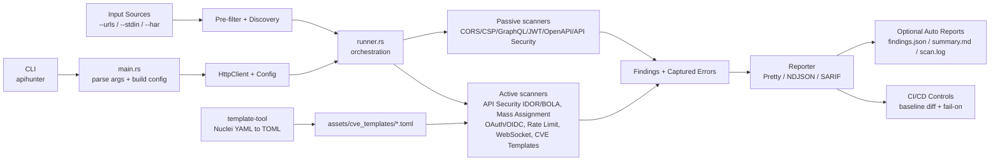

<div align="center">

# 🎯 ApiHunter


</div>

---

Async, modular API security scanner for API baseline testing and regression detection.  
Combines discovery with targeted checks (CORS/CSP/GraphQL/OpenAPI/JWT/API Security) using adaptive concurrency and CI-ready outputs (NDJSON/SARIF).

## Naming

- Project/repository: `ApiHunter`
- Cargo package: `apihunter`
- Library crate: `api_scanner`
- CLI binary: `apihunter` (default for `cargo run`)

## Repository Flow



## Why ApiHunter?

### Core Advantages

- **API-First Architecture**: Purpose-built for REST/GraphQL APIs, not adapted from web app scanners
- **Intelligent False Positive Reduction**: 
  - SPA catch-all detection with canary probing
  - Context-aware secret validation (frontend vs backend)
  - Body content validation and referer checking
  - Response fingerprinting to skip duplicate findings
- **Production-Safe by Design**:
  - Adaptive concurrency (AIMD) that backs off on errors
  - Per-host rate limiting with configurable delays
  - Politeness controls (retries, timeouts, WAF evasion)
  - Dry-run mode for active checks
- **Stealth & Evasion**:
  - Runtime User-Agent rotation from curated pool (assets/user_agents.txt)
  - Randomized request delays with jitter
  - Per-host delay enforcement (avoids burst patterns)
  - Retry logic with exponential backoff
  - Custom header injection for blending with legitimate traffic
  - Adaptive timing based on server responses
  - No hardcoded scanner fingerprints in default mode
- **CI/CD Native**:
  - Baseline diffing (only report new findings)
  - Streaming NDJSON output for real-time monitoring
  - SARIF 2.1.0 for GitHub/GitLab Code Scanning
  - Exit code bitmask for pipeline control
  - Severity-based filtering and failure thresholds
- **Performance at Scale**:
  - Rust async runtime (tokio) with zero-cost abstractions
  - Concurrent scanning with semaphore-bounded parallelism
  - Per-host HTTP client pools to avoid connection bottlenecks
  - Efficient memory usage (no GC pauses)
- **Comprehensive Auth Support**:
  - JSON-based auth flows with cookie/header extraction
  - Dual-identity IDOR/BOLA testing
  - Session file import (Excalibur integration)
  - Bearer, Basic, and custom header auth
  - Automatic unauth client for privilege escalation checks

## Scanner Modules

ApiHunter includes 11 built-in scanner modules. See [docs/scanners.md](docs/scanners.md) for detailed detection logic.

| Scanner | Type | What It Detects |
|---------|------|----------------|
| **CORS** | Passive | Wildcard origins, reflected origins with credentials, null origin acceptance, regex bypass vulnerabilities (suffix/prefix attacks), missing Vary: Origin, unsafe preflight methods |
| **CSP** | Passive | Missing Content-Security-Policy, unsafe-inline/unsafe-eval directives, wildcard sources, bypassable CDN hosts (JSONP gadgets), missing frame-ancestors |
| **GraphQL** | Passive | Introspection enabled, sensitive schema fields (user/password/token types), field suggestions (schema leakage), query batching, alias amplification (DoS), GraphiQL/Playground exposure |
| **JWT** | Passive | alg=none tokens, weak HS256 secrets (wordlist-based), missing/excessive expiry, sensitive claims in payload, algorithm confusion vulnerabilities |
| **OpenAPI** | Passive | Missing security schemes, operations without auth requirements, file upload endpoints, deprecated operations still present, unsecured sensitive endpoints |
| **API Security** | Passive + Active | Missing security headers (X-Content-Type-Options, X-Frame-Options), server version disclosure, unauthenticated access to sensitive paths, HTTP method enumeration, debug endpoints, secret exposure patterns, and active IDOR/BOLA checks |
| **Mass Assignment** | Active | Reflected sensitive fields (is_admin, role, permissions), persisted state changes, privilege escalation via field injection |
| **OAuth/OIDC** | Active | Redirect URI validation bypass, missing state parameter, PKCE support issues (missing S256, plain allowed), implicit flow enabled, password grant enabled |
| **Rate Limit** | Active | Missing rate limiting (burst probes), missing Retry-After headers, IP header spoofing bypass (X-Forwarded-For) |
| **WebSocket** | Active | WebSocket upgrade acceptance on common paths, missing origin validation, unauthenticated WebSocket connections |
| **CVE Templates** | Active | Template-driven CVE detection from `assets/cve_templates/*.toml` (168 templates currently), baseline vs bypass differential matching |

**Passive scanners** run by default and analyze responses without sending crafted requests.  
**Active scanners/checks** require `--active-checks` and send potentially invasive probes (IDOR/BOLA, mutation, bypass tests).  
IDOR/BOLA lives under the `API Security` scanner (there is no dedicated `--no-idor` flag; use `--no-api-security` to disable it).

## Features

### Passive Security Analysis
- **CORS Misconfiguration Detection**:
  - Dynamic origin generation based on target domain
  - Regex bypass testing (suffix/prefix attacks)
  - Credential-aware severity scoring
  - Wildcard and null origin detection
- **CSP Policy Analysis**:
  - Missing/weak Content Security Policy detection
  - Unsafe inline/eval directives
  - Wildcard source detection
  - Policy bypass patterns
- **GraphQL Security**:
  - Introspection query detection
  - Sensitive type/field name analysis
  - Query batching support detection
  - Alias amplification (DoS) probing
  - GraphiQL/Playground exposure
- **JWT Token Analysis**:
  - Algorithm confusion (alg=none, HS256→RS256)
  - Weak secret detection (curated wordlist)
  - Long-lived token detection (missing/excessive exp)
  - Sensitive claim exposure
  - Token extraction from headers and cookies
- **OpenAPI/Swagger Analysis**:
  - Security scheme validation
  - File upload endpoint detection
  - Deprecated operation flagging
  - Missing security definitions
  - Spec caching for performance
- **Secret Exposure Detection**:
  - AWS keys (AKIA*, secret keys)
  - Google API keys (AIza*)
  - GitHub tokens (ghp_*, github_pat_*)
  - Slack tokens (xox*)
  - Stripe keys (sk_live_*, pk_live_*)
  - Database URLs, private keys, bearer tokens
  - Context-aware validation (reduces false positives)
- **API Security Checks**:
  - HTTP method enumeration
  - Debug endpoint detection
  - Directory listing exposure
  - Security.txt presence
  - Response header analysis (HSTS, X-Frame-Options, etc.)
  - Error message disclosure

### Active Security Testing (--active-checks)
- **API Security IDOR/BOLA Checks** (3-tier approach):
  - Unauthenticated access testing
  - ID enumeration (±2 range walk)
  - Cross-user authorization bypass (dual-identity)
- **Mass Assignment Vulnerabilities**:
  - Reflected sensitive field injection
  - Persisted state change detection
  - Baseline→Mutate→Confirm verification
  - Privilege escalation via field injection
- **OAuth/OIDC Security**:
  - Redirect URI validation bypass
  - State parameter handling
  - PKCE support detection
  - Metadata configuration hardening
  - Implicit flow and password grant detection
- **Rate Limiting**:
  - Burst request probing
  - Missing rate limit detection
  - Retry-After header validation
  - IP header spoofing bypass tests
- **WebSocket Security**:
  - Upgrade acceptance on common paths
  - Origin validation testing
  - Missing authentication checks
- **CVE Template Engine**:
  - TOML-based template catalog
  - Nuclei YAML import support
  - Baseline vs bypass differential matching
  - Host+template deduplication
  - Current local catalog: 168 templates (includes curated hardened checks such as CVE-2022-22947, CVE-2021-29442, CVE-2021-29441, CVE-2020-13945, CVE-2021-45232, CVE-2022-24288)

### Discovery & Enumeration
- **Endpoint Discovery**:
  - robots.txt parsing
  - sitemap.xml parsing
  - OpenAPI/Swagger spec import
  - HAR file import (Excalibur integration)
  - JavaScript endpoint extraction
  - Same-host filtering
- **URL Accessibility Pre-filtering**:
  - Fast pre-check to skip dead endpoints
  - Configurable timeout
  - Optional bypass with --no-filter

### Performance & Reliability
- **Adaptive Concurrency (AIMD)**:
  - Automatic rate adjustment based on errors
  - Additive increase (every 5s)
  - Multiplicative decrease on 429/503/timeouts
- **Stealth & WAF Evasion**:
  - User-Agent rotation from runtime pool (assets/user_agents.txt with 100+ real UAs)
  - Embedded fallback UAs if file unavailable
  - Random delay jitter to avoid detection patterns
  - Per-host timing enforcement (not global)
  - Retry logic with exponential backoff
  - Custom header injection (X-Forwarded-For, Referer, etc.)
  - Adaptive timing based on 429/503 responses
  - Politeness mode for cooperative testing
  - No scanner fingerprints in User-Agent or headers by default
- **Resource Management**:
  - Semaphore-bounded parallelism
  - Per-host HTTP client pools
  - Connection reuse and pooling
  - Configurable timeouts and retries
- **Error Handling**:
  - Panic recovery via JoinSet
  - Captured errors reported separately
  - Graceful degradation on scanner failures

### Output & Reporting
- **Multiple Output Formats**:
  - Pretty JSON (human-readable)
  - NDJSON (streaming, parseable)
  - SARIF 2.1.0 (GitHub/GitLab Code Scanning)
- **Baseline Diffing**:
  - Generate baseline snapshots
  - Compare scans to report only new findings
  - Perfect for regression testing
- **Auto-Save Reports** (enabled by default, disable with `--no-auto-report`):
  - Saved to ~/Documents/ApiHunterReports/<timestamp>/
  - findings.json (structured findings)
  - summary.md (markdown report)
  - scan.log (execution log)
- **Real-Time Streaming**:
  - Stream findings as they're discovered
  - NDJSON format for live parsing
  - Progress tracking
- **Severity Filtering**:
  - Filter by minimum severity (info/low/medium/high/critical)
  - Fail-on threshold for CI/CD
  - Exit code bitmask (0x01 findings, 0x02 errors)

### Integration & Extensibility
- **Pluggable Scanner Architecture**:
  - Implement Scanner trait to add modules
  - Async-first design
  - Independent scanner execution
  - Panic isolation per scanner
- **TOML-Based Extensibility**:
  - CVE template catalog in assets/cve_templates/*.toml
  - No code changes needed to add new checks
  - Template-driven vulnerability detection
  - Community-shareable template format
- **Nuclei Template Import**:
  - template-tool binary for YAML → TOML conversion
  - Automatic matcher translation (status, word, regex, dsl)
  - Safe preflight request-chain extraction
  - Preserves detection logic from upstream templates
- **Dual Extension Model**:
  - **Code-based**: Write Rust scanners implementing Scanner trait for complex logic
  - **Template-based**: Write TOML templates for signature-based checks (CVEs, misconfigs)
  - Best of both worlds: performance + flexibility
- **Complementary Tools**:
  - Excalibur browser extension (HAR capture)
  - BurpAPIsecuritysuite (manual testing)
  - Workflow: Capture → Automate → Deep test

### Configuration & Control
- **Flexible Input**:
  - File-based URL lists
  - stdin (pipe from other tools)
  - HAR file import
  - OpenAPI spec import
- **Granular Scanner Control**:
  - Enable/disable individual scanners
  - Active vs passive mode
  - Dry-run for active checks
  - Per-scanner configuration
- **Network Configuration**:
  - HTTP/HTTPS proxy support
  - TLS certificate validation control
  - Custom headers and cookies
  - Configurable timeouts and retries
- **Scan Profiles**:
  - quickscan.sh (fast, low-impact)
  - deepscan.sh (comprehensive, active checks)
  - inaccessiblescan.sh (re-check previously inaccessible targets with slower settings)
  - baselinescan.sh (generate baseline)
  - diffscan.sh (compare against baseline)
  - authscan.sh (authenticated scanning)
  - sarifscan.sh (CI/CD integration)
  - scan-and-report.sh (run scan + print latest report path)
  - split-by-host.sh (split targets by host and optionally fan out scans)

## Comparison with Other Tools

| Feature | ApiHunter | Nuclei | ZAP | Burp Suite | ffuf |
|---------|-----------|--------|-----|------------|------|
| **Language** | Rust | Go | Java | Java | Go |
| **Performance** | ⚡⚡⚡ Async, adaptive concurrency | ⚡⚡ Fast parallel | ⚡ Moderate | ⚡ Moderate | ⚡⚡⚡ Very fast |
| **API-First Design** | ✅ Built for APIs | ❌ General web | ⚠️ Hybrid | ⚠️ Hybrid | ❌ Fuzzing focus |
| **False Positive Filtering** | ✅ SPA detection, body validation, referer checks | ⚠️ Template-dependent | ⚠️ Many FPs | ✅ Good | N/A |
| **CORS/CSP Analysis** | ✅ Deep policy parsing | ⚠️ Basic templates | ✅ Good | ✅ Good | ❌ |
| **GraphQL Introspection** | ✅ Schema exposure + sensitive field checks | ⚠️ Basic detection | ⚠️ Limited | ✅ Via extensions | ❌ |
| **OpenAPI/Swagger** | ✅ Security scheme analysis | ❌ | ✅ Import only | ✅ Import + scan | ❌ |
| **JWT Analysis** | ✅ alg=none, weak secrets, expiry | ⚠️ Via templates | ⚠️ Limited | ✅ Via extensions | ❌ |
| **IDOR/BOLA Detection** | ✅ 3-tier (unauth/range/cross-user) | ⚠️ Manual templates | ⚠️ Limited | ✅ Manual testing | ❌ |
| **Secret Detection** | ✅ Context-aware (frontend vs backend) | ⚠️ Regex-based | ⚠️ Basic | ⚠️ Basic | ❌ |
| **Active Checks** | ✅ Opt-in (IDOR, mass-assignment, OAuth/OIDC, websocket, rate-limit, CVE templates) | ✅ Template-based | ✅ Active scan | ✅ Active scan | ✅ Fuzzing |
| **WAF Evasion** | ✅ UA rotation, delays, retries, adaptive timing | ⚠️ Basic | ⚠️ Limited | ✅ Good | ⚠️ Basic |
| **CI/CD Integration** | ✅ NDJSON, SARIF, exit codes | ✅ JSON, SARIF | ⚠️ XML reports | ⚠️ XML/JSON | ✅ JSON |
| **Baseline Diffing** | ✅ Built-in | ❌ External tools | ❌ | ❌ | ❌ |
| **Auth Flows** | ✅ JSON-based pre-scan login | ⚠️ Header injection | ✅ Session mgmt | ✅ Session mgmt | ⚠️ Header injection |
| **Streaming Output** | ✅ Real-time NDJSON | ❌ Batch only | ❌ | ❌ | ✅ |
| **Resource Usage** | 🟢 Low (Rust) | 🟢 Low (Go) | 🟡 High (Java) | 🟡 High (Java) | 🟢 Low (Go) |
| **Learning Curve** | 🟢 Simple CLI | 🟢 Template syntax | 🟡 GUI complexity | 🔴 Steep | 🟢 Simple |
| **Extensibility** | ✅ Rust trait system | ✅ YAML templates | ✅ Add-ons | ✅ Extensions | ⚠️ Limited |
| **License** | MIT (Free) | MIT (Free) | Apache 2.0 (Free) | Commercial | MIT (Free) |
| **Best For** | API security in CI/CD, regression testing, CORS/GraphQL/JWT analysis | General vuln scanning, CVE detection | Full web app pentesting | Manual pentesting, complex workflows | Directory/parameter fuzzing |

### Key Differentiators

**ApiHunter:** API-first design, SPA detection, baseline diffing, 3-tier IDOR/BOLA, context-aware secrets, AIMD concurrency, **stealth/WAF evasion (UA rotation, jitter, adaptive timing)**, **dual extensibility (TOML templates + Rust modules)**  
**Nuclei:** Broader CVE coverage, YAML templates only, basic evasion  
**ZAP/Burp:** Manual testing, proxy workflows, GUI-based extensions, limited stealth  
**ffuf:** Pure fuzzing, content discovery, limited extensibility, basic evasion

## Quick Start

```bash
cargo build --release

# Scan URLs from a file (newline-delimited)
./target/release/apihunter --urls ./targets/cve-regression-real-public.txt --format ndjson --output ./results.ndjson

# Or scan URLs from stdin
cat ./targets/cve-regression-real-public.txt | ./target/release/apihunter --stdin --min-severity medium
```

See [HOWTO.md](HOWTO.md) for detailed usage, [docs/lab-setup.md](docs/lab-setup.md) for Vulhub-based CVE validation labs, and [docs/](docs/) for internals.

## Architecture

```
main.rs  ──► cli.rs (args) ──► config.rs (Config)
                                     │
                               runner.rs (orchestration)
                              ┌──────┴────────────────────────────┐
                    discovery/               scanner/
                    ├─ robots.rs             ├─ cors.rs
                    ├─ sitemap.rs            ├─ csp.rs
                    ├─ swagger.rs            ├─ jwt.rs
                    ├─ js.rs                 ├─ graphql.rs
                    ├─ headers.rs            ├─ openapi.rs
                    └─ common_paths.rs       ├─ mass_assignment.rs
                                             ├─ oauth_oidc.rs
                              http_client.rs ├─ rate_limit.rs
                              auth.rs        ├─ cve_templates.rs
                              waf.rs         └─ websocket.rs
                              reports.rs
                              error.rs
```

**Flow:** CLI args → Config → Runner orchestrates Discovery + Scanners → HTTP Client (with Auth/WAF) → Reports

## Template Tooling

ApiHunter supports **dual extensibility**: add checks via **TOML templates** (no code) or **Rust modules** (full control).

### TOML Template Format
Create custom checks in `assets/cve_templates/*.toml`:
```toml
id = "custom-api-check"
name = "Custom API Vulnerability"
severity = "high"

[[requests]]
method = "GET"
path = "/api/vulnerable"

[[requests.matchers]]
type = "status"
values = [200]

[[requests.matchers]]
type = "word"
part = "body"
words = ["sensitive_data", "exposed"]
```

### Import Nuclei Templates
Convert existing Nuclei YAML templates:
```bash
cargo run --bin template-tool -- import-nuclei \
  --input tests/fixtures/upstream_nuclei/CVE-2022-24288.yaml \
  --output assets/cve_templates/cve-2022-24288.toml
```

### Add Custom Rust Scanners
Implement the `Scanner` trait for complex logic:
```rust
#[async_trait]
impl Scanner for MyCustomScanner {
    async fn scan(
        &self,
        url: &str,
        client: &HttpClient,
        config: &Config,
    ) -> (Vec<Finding>, Vec<CapturedError>) {
        // Your custom scanning logic
    }
}
```

See [HOWTO.md](HOWTO.md#import-a-nuclei-cve-template-into-apihunter-toml) and [docs/scanners.md](docs/scanners.md) for details.

## Scan Scripts

`ScanScripts/` contains convenience wrappers for common scan profiles:

- **quickscan.sh** - Fast, low-impact scan (concurrency: 10, max-endpoints: 20, timeout: 5s, retries: 0, delay: 50ms)
- **deepscan.sh** - Comprehensive scan with active checks (adaptive concurrency, per-host clients, unlimited endpoints, retries: 3, timeout: 20s, delay: 200ms)
- **defaultscan.sh** - Run with CLI defaults (no preset flags)
- **baselinescan.sh** - Generate baseline NDJSON for diffing
- **diffscan.sh** - Compare against baseline and report only new findings
- **authscan.sh** - Authenticated scan with auth flows (requires `--auth-flow`, enables active checks, WAF evasion, retries: 2, timeout: 15s, delay: 150ms)
- **sarifscan.sh** - Output SARIF format for CI/CD integration
- **inaccessiblescan.sh** - Re-scan previously inaccessible URLs with conservative retry/timeouts
- **scan-and-report.sh** - Run scan and print latest auto-saved report location
- **split-by-host.sh** - Split URL list into per-host files and optionally scan them in parallel

### Usage Examples

```bash
# Quick scan from file
./ScanScripts/quickscan.sh targets/cve-regression-real-public.txt

# Deep scan from stdin
cat targets/cve-regression-real-public.txt | ./ScanScripts/deepscan.sh --stdin

# Generate baseline
./ScanScripts/baselinescan.sh targets/cve-regression-real-public.txt

# Compare against baseline
./ScanScripts/diffscan.sh targets/cve-regression-real-public.txt baseline.ndjson

# Authenticated scan
./ScanScripts/authscan.sh targets/cve-regression-real-public.txt --auth-flow auth.json

# SARIF output for GitHub Code Scanning
./ScanScripts/sarifscan.sh targets/cve-regression-real-public.txt

# Split by host and scan in parallel
./ScanScripts/split-by-host.sh targets/cve-regression-real-public.txt --scan-cmd ./ScanScripts/quickscan.sh --jobs 4
```

All wrapper scripts except `split-by-host.sh` support `--stdin` and trailing ApiHunter flags.

## Documentation

Complete documentation is available in `docs/`. Start with:

- [Documentation Index](docs/INDEX.md)
- [Architecture](docs/architecture.md)
- [Configuration](docs/configuration.md)
- [Auth Flow](docs/auth-flow.md)
- [Scanners](docs/scanners.md)
- [Findings & Remediation](docs/findings.md)
- [HOWTO](HOWTO.md)

## Roadmap

**Completed:** WebSocket/Mass-Assignment/OAuth/Rate-Limit/CVE scanners, expanded Nuclei importer (regex/dsl + safe preflight chains), Docker image  
**Next:** Expand CVE templates, stealth hardening (remove scanner markers, randomize probes), broader matcher/operator parity for advanced Nuclei expressions

## Installation

Requires Rust stable (tested on 1.76+).

```bash
git clone https://github.com/Teycir/ApiHunter
cd ApiHunter
cargo build --release
```

### Docker

```bash
docker build -t apihunter:local .
docker run --rm apihunter:local --help
```

Run a scan from files in your current directory:

```bash
docker run --rm -v "$PWD:/work" apihunter:local \
  --urls /work/targets/cve-regression-real-public.txt \
  --format ndjson \
  --output /work/results.ndjson
```

## CLI Reference

| Flag | Default | Description |
|---|---|---|
| `--urls` | required* | Path to newline-delimited URL file |
| `--stdin` | off | Read newline-delimited URLs from stdin |
| `--har` | off | Import likely API request URLs from HAR (`log.entries[].request.url`) |
| `--output` | stdout | Write results to a file instead of stdout |
| `--format` | `pretty` | Output format: `pretty`, `ndjson`, or `sarif` |
| `--stream` | off | Stream NDJSON findings as they arrive |
| `--baseline` | none | Baseline NDJSON for diff-only findings |
| `--quiet` | off | Suppress non-error stdout output |
| `--summary` | off | Print summary even in quiet mode |
| `--no-auto-report` | off | Skip writing local auto reports under `~/Documents/ApiHunterReports` |
| `--min-severity` | `info` | Filter findings below this level |
| `--fail-on` | `medium` | Exit non-zero at or above this severity |
| `--concurrency` | `20` | Max in-flight requests |
| `--max-endpoints` | `50` | Limit scanned endpoints per site (0 = unlimited) |
| `--delay-ms` | `150` | Minimum delay between requests per host |
| `--retries` | `1` | Retry attempts on transient failure |
| `--timeout-secs` | `8` | Per-request timeout in seconds |
| `--no-filter` | off | Skip pre-filtering of inaccessible URLs |
| `--filter-timeout` | `3` | Timeout for accessibility pre-check (seconds) |
| `--no-discovery` | off | Skip endpoint discovery and scan only provided seed URLs |
| `--waf-evasion` | off | Enable WAF evasion heuristics |
| `--user-agents` | none | Comma-separated UA list (implies WAF evasion) |
| `--headers` | none | Extra request headers (e.g. `Authorization: Bearer ...`) |
| `--cookies` | none | Comma-separated cookies (e.g. `session=abc,theme=dark`) |
| `--auth-bearer` | none | Add `Authorization: Bearer <token>` |
| `--auth-basic` | none | Add HTTP Basic auth (`user:pass`) |
| `--auth-flow` | none | JSON auth flow file (pre-scan login) |
| `--auth-flow-b` | none | Second auth flow for cross-user IDOR checks |
| `--unauth-strip-headers` | none | Extra header names to strip for unauth probes |
| `--session-file` | none | Load/save cookies from Excalibur session JSON (`{"hosts": {...}}`) |
| `--proxy` | none | HTTP/HTTPS proxy URL |
| `--danger-accept-invalid-certs` | off | Skip TLS certificate validation |
| `--active-checks` | off | Enable active (potentially invasive) probes |
| `--dry-run` | off | Dry-run active checks (report intended probes without sending mutation requests) |
| `--per-host-clients` | off | Use per-host HTTP client pools |
| `--adaptive-concurrency` | off | Adaptive concurrency (AIMD) |
| `--no-cors` | off | Disable the CORS scanner |
| `--no-csp` | off | Disable the CSP scanner |
| `--no-graphql` | off | Disable the GraphQL scanner |
| `--no-api-security` | off | Disable the API security scanner |
| `--no-jwt` | off | Disable the JWT scanner |
| `--no-openapi` | off | Disable the OpenAPI scanner |
| `--no-mass-assignment` | off | Disable the Mass Assignment scanner (active checks) |
| `--no-oauth-oidc` | off | Disable the OAuth/OIDC scanner (active checks) |
| `--no-rate-limit` | off | Disable the Rate Limit scanner (active checks) |
| `--no-cve-templates` | off | Disable the CVE template scanner (active checks) |
| `--no-websocket` | off | Disable the WebSocket scanner (active checks) |

*You must provide exactly one of `--urls`, `--stdin`, or `--har`.

## Exit Codes

| Code | Meaning |
|---|---|
| `0` | No findings at/above `--fail-on` threshold and no errors |
| `1` | One or more findings at/above `--fail-on` threshold |
| `2` | One or more scanners captured errors |
| `3` | Both findings and errors |

## Related Projects

ApiHunter is part of a complementary security testing toolkit:

- **[Excalibur](https://github.com/Teycir/Excalibur)** - Browser extension for capturing API traffic and exporting HAR files with session cookies. Use with ApiHunter via `--har` and `--session-file` flags.
- **[BurpAPIsecuritysuite](https://github.com/Teycir/BurpAPIsecuritysuite)** - Burp Suite extension for interactive API security testing. Complements ApiHunter's automated scanning with manual testing workflows.

**Workflow:** Capture traffic with Excalibur → Automated baseline with ApiHunter → Deep manual testing with BurpAPIsecuritysuite

## About

**Author:** Teycir Ben Soltane  
**Email:** teycir@pxdmail.net  
**Website:** [teycirbensoltane.tn](https://teycirbensoltane.tn)

## FAQ

**Q: Why ApiHunter vs Nuclei/ZAP/Burp?**  
A: API-first design, SPA detection, baseline diffing, 3-tier IDOR, context-aware secrets. Complementary to Nuclei (CVE coverage) and ZAP/Burp (manual testing).

**Q: Production-safe?**  
A: Yes. Use `--delay-ms` and lower `--concurrency`. Try `quickscan.sh`.

**Q: Authenticated scans?**  
A: `--auth-bearer`, `--auth-basic`, or `--auth-flow`. For IDOR: `--auth-flow-b`.

**Q: Speed comparison (1000 endpoints)?**  
Depends on endpoint latency, retries, target behavior, and enabled checks. Use `--concurrency`, `--delay-ms`, and `--active-checks` to tune throughput vs impact.

**Q: Slow scan?**  
Increase `--concurrency` (default: 20), reduce `--delay-ms` (default: 150ms), enable `--adaptive-concurrency`.

**Q: Output formats?**  
`pretty` (default), `ndjson` (streaming), `sarif` (CI integration).

**Q: CI/CD integration?**  
```bash
./target/release/apihunter --urls targets/cve-regression-real-public.txt --fail-on medium --format sarif --output results.sarif
```

**Q: Baseline diffing?**  
```bash
./target/release/apihunter --urls targets/cve-regression-real-public.txt --format ndjson --output baseline.ndjson
./target/release/apihunter --urls targets/cve-regression-real-public.txt --baseline baseline.ndjson --format ndjson
```

**Q: Passive vs active checks?**  
Passive (default): analyze responses. Active (`--active-checks`): send crafted requests (IDOR, mass-assignment, OAuth, rate-limit, CVE probes).

**Q: CORS testing?**  
Dynamic origin generation: `null`, `https://evil.com`, `https://<target>.evil.com`, `https://evil<target>`. Tests regex bypasses when reflected.

**Q: IDOR detection?**  
3-tier: (1) unauthenticated fetch, (2) ID enumeration (±2), (3) cross-user (`--auth-flow-b`).

**Q: Secret detection?**  
AWS/Google/GitHub/Slack/Stripe keys, bearer tokens, DB URLs, private keys. Context-aware validation.

**Q: Cookies?**  
`--cookies "session=abc"`, `--session-file excalibur.json`, or `--auth-flow login.json`.

**Q: Proxy?**  
`--proxy http://proxy.corp.com:8080`

**Q: Debug logging?**  
`RUST_LOG=debug ./target/release/apihunter --urls targets/cve-regression-real-public.txt`

**Q: Adaptive concurrency?**  
AIMD: increases by 1 every 5s, halves on errors (429/503/timeouts). Enable with `--adaptive-concurrency`.

**Q: Disable scanners?**  
`--no-cors`, `--no-csp`, `--no-graphql`, `--no-api-security`, `--no-jwt`, `--no-openapi`, `--no-mass-assignment`, `--no-oauth-oidc`, `--no-rate-limit`, `--no-cve-templates`, `--no-websocket`.

**Q: Is ApiHunter stealthy?**  
A: Yes. Features: UA rotation from 100+ real browsers (assets/user_agents.txt), randomized delays with jitter, per-host rate limiting, adaptive backoff on 429/503, no scanner fingerprints in headers, exponential retry logic, custom header injection. Enable with `--waf-evasion`.

**Q: How does WAF evasion work?**  
A: Automatically rotates User-Agents from curated pool, adds random jitter to delays, enforces per-host timing (not global bursts), backs off exponentially on rate limits, and allows custom header injection to blend with legitimate traffic. No "scanner" strings in default headers.

See [CONTRIBUTING.md](CONTRIBUTING.md) for development guidelines.

## License

[MIT](Licence)
